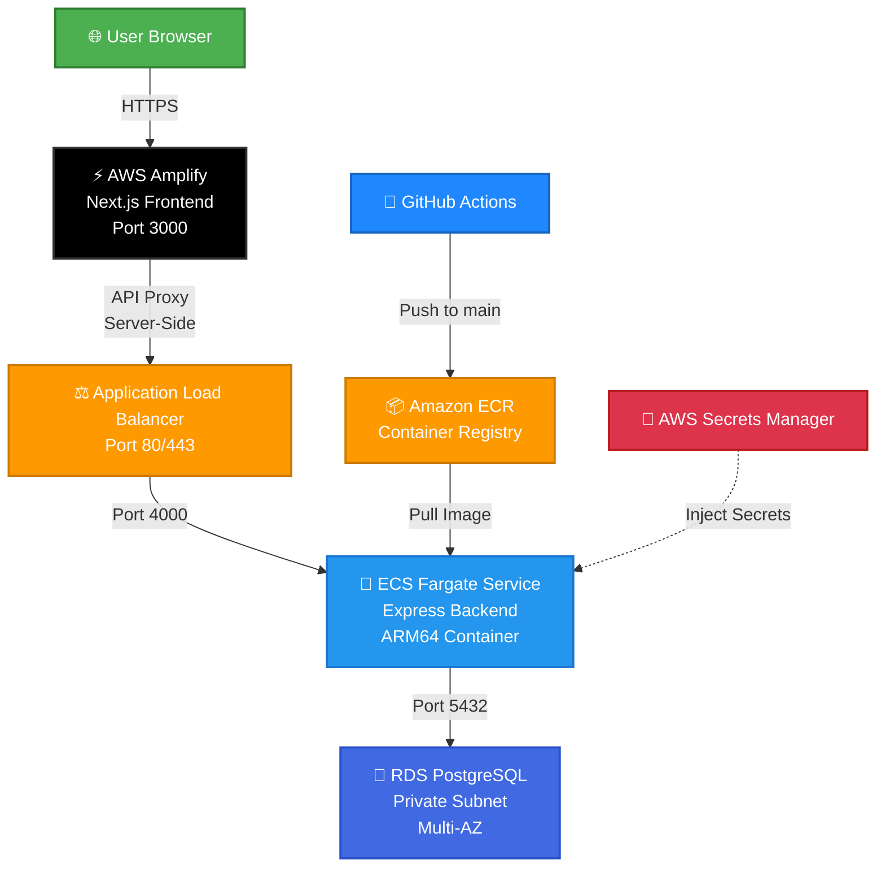
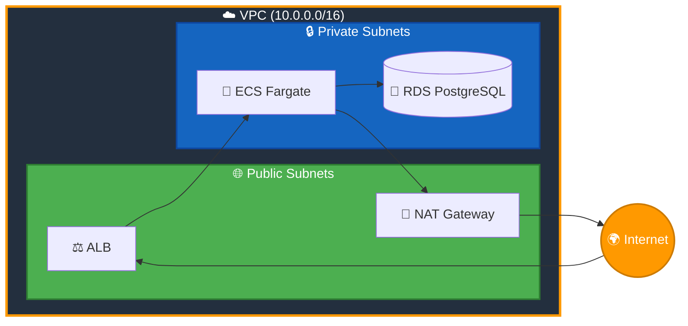

<div align="center">


# 🚀 AWS ECS Fargate Full-Stack Application

[](https://github.com/Ai-with-Gaurav/aws-fargate-ecs/actions/workflows/deploy.yml)


<br/>


<br/><br/>

> 🌟 A production-grade full-stack web application deployed on AWS using serverless containers with fully automated CI/CD pipeline.

---

### 🎯 Features

`✅ Serverless Containers` `✅ Auto-scaling` `✅ CI/CD Pipeline` `✅ Private Database` `✅ Secrets Management` `✅ Load Balanced` `✅ Multi-AZ` `✅ Rolling Deployments`

</div>

---

## 🏗️ Architecture



---

## 🌍 Live URLs

<div align="center">

| | Component | URL | Status |
|:--:|:---------:|:---:|:------:|
| 🖥️ | **Frontend** | [`https://main.d1bi6naztta26q.amplifyapp.com`](https://main.d1bi6naztta26q.amplifyapp.com) |  |
| ⚙️ | **Backend API** | [`http://my-app-alb-117181659.ap-southeast-1.elb.amazonaws.com`](http://my-app-alb-117181659.ap-southeast-1.elb.amazonaws.com/api/v1/health) |  |
| 💚 | **Health Check** | [`/api/v1/health`](http://my-app-alb-117181659.ap-southeast-1.elb.amazonaws.com/api/v1/health) |  |
| 📦 | **Products API** | [`/api/v1/products`](http://my-app-alb-117181659.ap-southeast-1.elb.amazonaws.com/api/v1/products) |  |

</div>

---

## 🛠️ Tech Stack

<table>
<tr>
<td align="center" width="150">
<br/>

<br/><br/>

**🎨 Frontend**
<br/>
Next.js 14<br/>
React 18<br/>
TypeScript
<br/><br/>
</td>
<td align="center" width="150">
<br/>

<br/><br/>

**⚙️ Backend**
<br/>
Node.js 20<br/>
Express.js<br/>
REST API
<br/><br/>
</td>
<td align="center" width="150">
<br/>

<br/><br/>

**🐘 Database**
<br/>
PostgreSQL 17<br/>
AWS RDS<br/>
Private Subnet
<br/><br/>
</td>
<td align="center" width="150">
<br/>

<br/><br/>

**🐳 Containers**
<br/>
Docker<br/>
ECS Fargate<br/>
ARM64
<br/><br/>
</td>
<td align="center" width="150">
<br/>

<br/><br/>

**🔄 CI/CD**
<br/>
GitHub Actions<br/>
Auto Deploy<br/>
Rolling Update
<br/><br/>
</td>
</tr>
</table>

---

## 📁 Project Structure

```
📦 aws-fargate-ecs/
│
├── 🔧 backend/                          # Express.js API Server
│   ├── 📂 src/
│   │   ├── 📄 index.js                  # Server entry point
│   │   ├── 📂 routes/
│   │   │   ├── 📄 health.js             # GET /api/v1/health
│   │   │   └── 📄 api.js                # Product CRUD endpoints
│   │   ├── 📂 config/
│   │   │   └── 📄 database.js           # PostgreSQL pool config
│   │   └── 📂 middleware/
│   │       └── 📄 cors.js               # CORS whitelist
│   ├── 🐳 Dockerfile                    # Multi-stage ARM64 build
│   ├── 📄 task-definition.json          # ECS Fargate task config
│   ├── 📄 init.sql                      # DB schema & seed data
│   └── 📄 package.json
│
├── 🎨 frontend/                          # Next.js Application
│   ├── 📂 src/
│   │   ├── 📂 app/
│   │   │   ├── 📄 page.tsx              # Product management UI
│   │   │   ├── 📄 layout.tsx            # Root layout
│   │   │   └── 📂 api/                  # Server-side API proxy
│   │   │       ├── 📂 health/route.ts   # Proxy → /api/v1/health
│   │   │       └── 📂 products/route.ts # Proxy → /api/v1/products
│   │   └── 📂 lib/
│   │       └── 📄 api.ts                # Frontend API client
│   ├── 📄 next.config.js
│   └── 📄 package.json
│
├── 🏗️ infrastructure/
│   └── 📄 setup-guide.md                # 11-phase AWS setup guide
│
└── 🔄 .github/workflows/
    └── 📄 deploy.yml                    # CI/CD pipeline
```

---

## 📡 API Endpoints

<div align="center">

| Method | Endpoint | Description | Response |
|:------:|:---------|:------------|:---------|
|  | `/api/v1/health` | Health check + DB status | `{"status": "healthy", "database": "connected"}` |
|  | `/api/v1/products` | List all products | `{"data": [...]}` |
|  | `/api/v1/products/:id` | Get single product | `{"data": {...}}` |
|  | `/api/v1/products` | Create new product | `{"data": {...}}` |

</div>

---

## 💻 Local Development

<table>
<tr>
<td width="50%">

### 🔧 Backend
```bash
cd backend
npm install
npm run dev
```
> 🟢 Runs on `http://localhost:4000`

</td>
<td width="50%">

### 🎨 Frontend
```bash
cd frontend
npm install
npm run dev
```
> 🟢 Runs on `http://localhost:3000`

</td>
</tr>
</table>

### 🐳 Docker
```bash
cd backend
docker build --platform linux/arm64 -t my-app-backend .
docker run -p 4000:4000 --env-file .env my-app-backend
```

---

## ☁️ AWS Infrastructure

<table>
<tr>
<td width="50%">

### 🌐 Networking
| Resource | Details |
|:---------|:--------|
|  | `10.0.0.0/16` — 65,000 IPs |
|  | 2 Public + 2 Private (2 AZs) |
|  | Public subnet internet access |
|  | Private subnet outbound access |
|  | Least-privilege firewall rules |

</td>
<td width="50%">

### 🖥️ Compute & Storage
| Resource | Details |
|:---------|:--------|
|  | ARM64, 0.25 vCPU, 512MB |
|  | PostgreSQL 17, db.t3.micro |
|  | Docker image registry |
|  | Layer 7 load balancer |
|  | Next.js SSR hosting |

</td>
</tr>
<tr>
<td width="50%">

### 🔐 Security
- 🛡️ RDS in **private subnet** — no public access
- 🔑 Credentials in **AWS Secrets Manager**
- 🔒 **Security groups** enforce strict access
- 🔄 API proxy avoids **mixed content** (HTTPS→HTTP)
- 👤 **IAM roles** with least-privilege access

</td>
<td width="50%">

### 🔄 CI/CD Pipeline
On every push to `main`:
1. 🏗️ Build **ARM64** Docker image
2. 📤 Push to **Amazon ECR**
3. 📝 Update **ECS task definition**
4. 🚀 **Rolling deployment** to Fargate
5. ⚡ **Amplify** auto-deploys frontend

</td>
</tr>
</table>

---

## 🗺️ AWS Services Map

<div align="center">

| Service | Purpose | Region |
|:--------|:--------|:------:|
|  | Isolated private cloud network | `ap-southeast-1` |
|  | Serverless container orchestration | `ap-southeast-1` |
|  | Serverless compute for containers | `ap-southeast-1` |
|  | Managed PostgreSQL database | `ap-southeast-1` |
|  | Docker container registry | `ap-southeast-1` |
|  | Application load balancer | `ap-southeast-1` |
|  | Frontend hosting & deployment | `ap-southeast-1` |
|  | Secure credential storage | `ap-southeast-1` |
|  | Logging & monitoring | `ap-southeast-1` |
|  | Identity & access management | Global |

</div>

---

## 📊 Infrastructure Diagram



---

<div align="center">

### 🧹 Cleanup (Avoid Charges!)

> ⚠️ **Important:** Delete resources in the correct order to avoid orphaned dependencies and unnecessary charges.

</div>

```
1. ECS Service (set desired count to 0, then delete)
2. ECS Cluster
3. ALB + Target Groups
4. NAT Gateway (costs ~$0.045/hr)
5. Elastic IP
6. RDS Database
7. ECR Repository
8. Secrets Manager secrets
9. Amplify app
10. IAM user + roles
11. VPC (subnets, route tables, gateways)
```

---

<div align="center">


<br/><br/>

### ⭐ Star this repo if you found it helpful!

**Made with ❤️ by [Ai-with-Gaurav](https://github.com/Ai-with-Gaurav)**

[](https://github.com/Ai-with-Gaurav)
[](https://github.com/Ai-with-Gaurav/aws-fargate-ecs)

</div>
