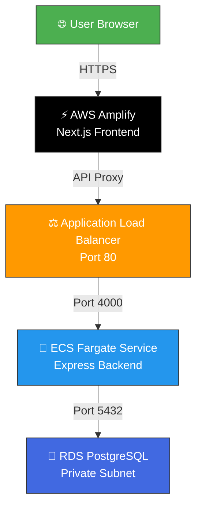

<div align="center">

# 🚀 AWS ECS Fargate Full-Stack Application

[](https://github.com/Ai-with-Gaurav/aws-fargate-ecs/actions/workflows/deploy.yml)


<br/>

> A production-grade full-stack web application deployed on AWS using serverless containers with automated CI/CD.

</div>

---

## 🏗️ Architecture



---

## 🌍 Live URLs

| Component | URL |
|:---------:|:---:|
| 🖥️ **Frontend** | [`https://main.d1bi6naztta26q.amplifyapp.com`](https://main.d1bi6naztta26q.amplifyapp.com) |
| ⚙️ **Backend API** | [`http://my-app-alb-117181659.ap-southeast-1.elb.amazonaws.com`](http://my-app-alb-117181659.ap-southeast-1.elb.amazonaws.com/api/v1/health) |

---

## 🛠️ Tech Stack

<table>
<tr>
<td align="center" width="150">

### 🎨 Frontend
<br/>
Next.js 14<br/>
React 18<br/>
TypeScript

</td>
<td align="center" width="150">

### ⚙️ Backend
<br/>
Node.js<br/>
Express<br/>
REST API

</td>
<td align="center" width="150">

### 🐘 Database
<br/>
PostgreSQL<br/>
AWS RDS<br/>
Private Subnet

</td>
<td align="center" width="150">

### 🐳 Containers
<br/>
Docker<br/>
ECS Fargate<br/>
ARM64

</td>
<td align="center" width="150">

### 🔄 CI/CD
<br/>
GitHub Actions<br/>
Auto Deploy<br/>
Rolling Update

</td>
</tr>
</table>

---

## 📁 Project Structure

```
📦 aws-fargate-ecs/
├── 🔧 backend/
│   ├── 📂 src/
│   │   ├── 📄 index.js                 # Express server entry point
│   │   ├── 📂 routes/
│   │   │   ├── 📄 health.js            # Health check endpoint
│   │   │   └── 📄 api.js               # Product CRUD API
│   │   ├── 📂 config/
│   │   │   └── 📄 database.js          # PostgreSQL connection
│   │   └── 📂 middleware/
│   │       └── 📄 cors.js              # CORS configuration
│   ├── 🐳 Dockerfile                   # Docker image (ARM64)
│   ├── 📄 task-definition.json         # ECS Fargate task config
│   ├── 📄 init.sql                     # DB schema & seed data
│   └── 📄 package.json
├── 🎨 frontend/
│   ├── 📂 src/
│   │   ├── 📂 app/
│   │   │   ├── 📄 page.tsx             # Home page
│   │   │   ├── 📄 layout.tsx           # Root layout
│   │   │   └── 📂 api/                 # API proxy routes
│   │   └── 📂 lib/
│   │       └── 📄 api.ts               # API client
│   └── 📄 package.json
├── 🏗️ infrastructure/
│   └── 📄 setup-guide.md               # AWS setup guide
└── 🔄 .github/workflows/
    └── 📄 deploy.yml                   # CI/CD pipeline
```

---

## 📡 API Endpoints

| Method | Endpoint | Description |
|:------:|:---------|:------------|
| 🟢 `GET` | `/api/v1/health` | Health check with DB status |
| 🔵 `GET` | `/api/v1/products` | List all products |
| 🔵 `GET` | `/api/v1/products/:id` | Get product by ID |
| 🟡 `POST` | `/api/v1/products` | Create a new product |

---

## 💻 Local Development

### Backend
```bash
cd backend
npm install
npm run dev    # 🚀 Starts on http://localhost:4000
```

### Frontend
```bash
cd frontend
npm install
npm run dev    # 🚀 Starts on http://localhost:3000
```

---

## ☁️ AWS Infrastructure

<table>
<tr>
<td>

### 🌐 Networking
- **VPC** `10.0.0.0/16` across 2 AZs
- **Internet Gateway** for public access
- **NAT Gateway** for private outbound
- **Security Groups** with least-privilege rules

</td>
<td>

### 🖥️ Compute & Storage
- **ECS Fargate** — ARM64, 0.25 vCPU, 512MB
- **RDS PostgreSQL** — db.t3.micro, private subnet
- **ECR** — Docker image registry
- **ALB** — Layer 7 load balancer

</td>
</tr>
<tr>
<td>

### 🔐 Security
- RDS in private subnet, no public access
- Secrets in AWS Secrets Manager
- Security groups enforce strict access
- API proxy avoids mixed content

</td>
<td>

### 🔄 CI/CD Pipeline
On push to `main`:
1. Build ARM64 Docker image
2. Push to Amazon ECR
3. Update ECS task definition
4. Rolling deployment to Fargate
5. Amplify auto-deploys frontend

</td>
</tr>
</table>

---

## 🗺️ AWS Services Used

| Service | Purpose |
|:--------|:--------|
|  | Isolated private cloud network |
|  | Serverless container orchestration |
|  | Managed PostgreSQL database |
|  | Docker image registry |
|  | Application load balancer |
|  | Frontend hosting & deployment |
|  | Secure credential storage |
|  | Logging & monitoring |

---

<div align="center">

### ⭐ Star this repo if you found it helpful!

Made with ❤️ by [Ai-with-Gaurav](https://github.com/Ai-with-Gaurav)

</div>
